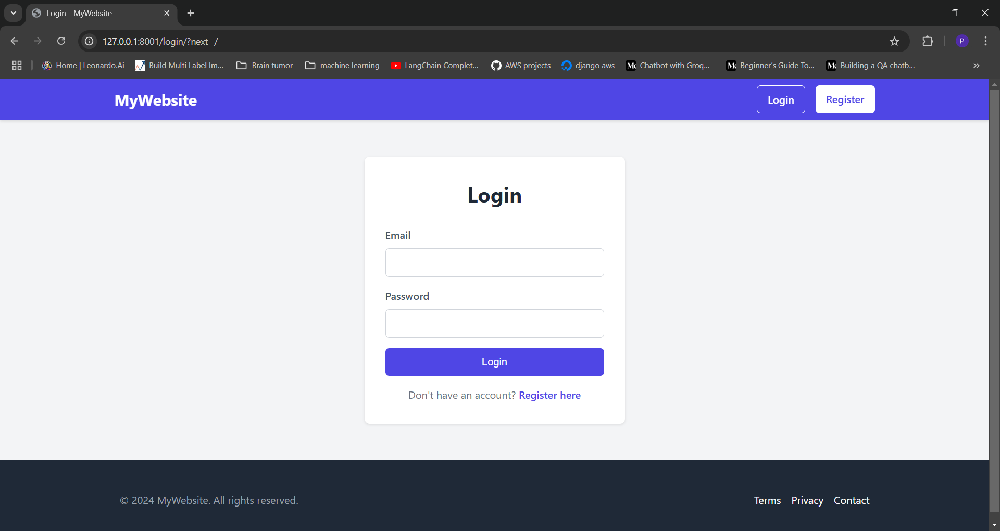
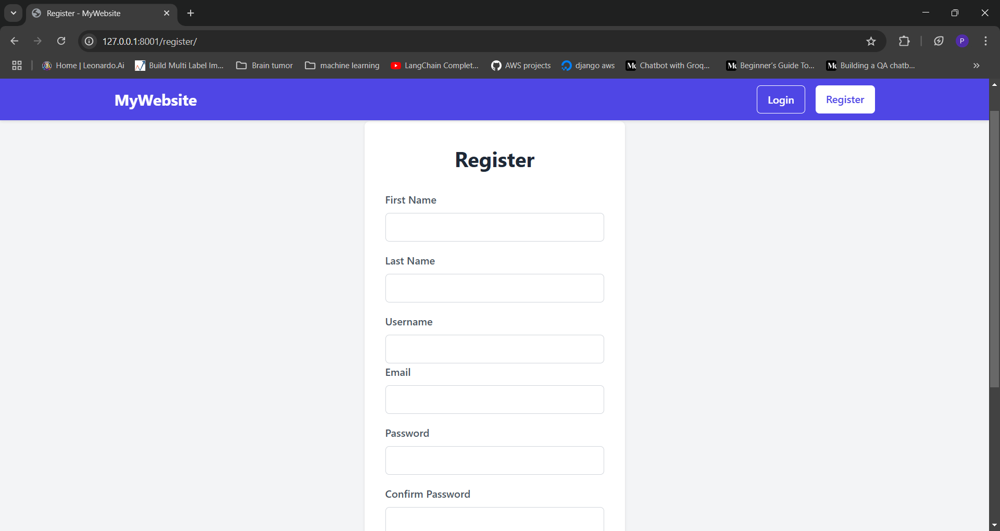
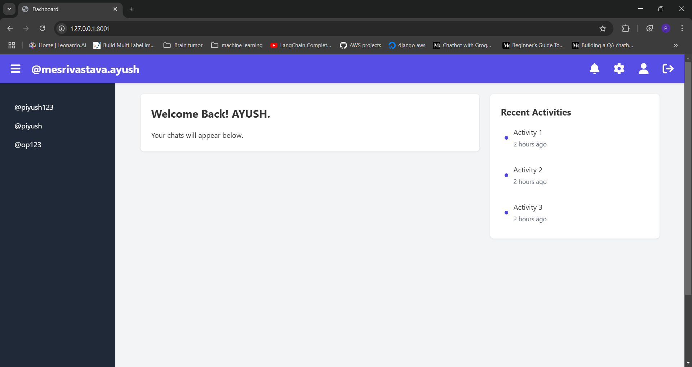
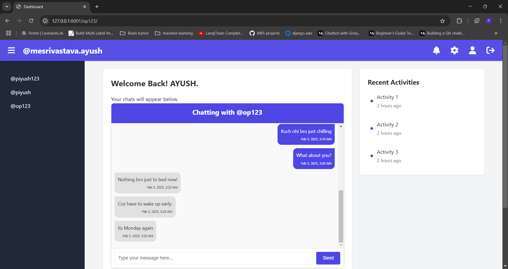

# Real-time Chat Application

## Overview
This is a real-time chat application built using Django and Django Channels. It supports user authentication, real-time messaging, and a simple user interface for chatting.

## Screenshots
- **Login Page**: 
- **Registration Page**: 
- **Home Page**: 
- **Chat Page**: 

## Technologies Used
- **Django**: Backend framework for handling user authentication and database management.
- **Django Channels**: For handling WebSocket connections to enable real-time communication.
- **SQLite**: Database for storing user and chat data.
- **HTML/CSS/JavaScript**: Frontend technologies for the user interface.

## Features
- User registration, login, and logout
- Real-time messaging using WebSockets
- Error handling for user registration (e.g., username conflicts, password mismatches)

## Installation

1. **Clone the repository:**
   ```sh
   git clone https://github.com/Piyush-sri11/Chat-app.git
   cd Chat-app
   ```

2. **Create a virtual environment and activate it:**
    ```sh
    python -m venv venv
    source venv/bin/activate  # On Windows use `venv\Scripts\activate`
    ```
    
3. **Install the required packages:**
        ```sh
        pip install -r requirements.txt
        ```

4. **Apply database migrations:**
    ```sh
    python manage.py migrate
    ```

5. **Run the development server:**
    ```sh
    python manage.py runserver
    ```

6. **Open your browser and navigate to:**
    ```
    http://127.0.0.1:8000/
    ```

## Usage
- **Register**: Create a new user account.
- **Login**: Log in with your credentials.
- **Chat**: Start chatting in real-time with other users.

## Project Structure
- `server/models.py`: Contains the `CustomUser` and `ChatModel` for user and chat data.
- `server/views.py`: Handles user login, registration, and chat page rendering.
- `server/routing.py`: WebSocket routing configuration.
- `chat/asgi.py`: Integration with Django's ASGI application.
- `server/templates`: HTML templates for the chat interface.
- `server/migrations`: Database migration files.

## Contributing
Contributions are welcome! Please fork the repository and submit a pull request.

## License
This project is licensed under the MIT License. See the LICENSE file for details.